# Módulo de Requerimientos de Compra (Purchase Requests)

## 📋 Índice
1. [Visión General](#visión-general)
2. [Schema de Base de Datos](#schema-de-base-de-datos)
3. [Workflow y Estados](#workflow-y-estados)
4. [Integración ERP](#integración-erp)
5. [API Endpoints](#api-endpoints)
6. [Flujo End-to-End](#flujo-end-to-end)
7. [Integración con IA](#integración-con-ia)
8. [Seguridad y Permisos](#seguridad-y-permisos)

---

## Visión General

### Objetivo
Gestionar el ciclo completo de requerimientos de compra desde la solicitud inicial hasta la recepción de mercadería, con integración bidireccional al ERP Softland.

### Actores
- **Solicitante**: Usuario que crea el requerimiento
- **Aprobadores**: Usuarios que aprueban según niveles configurados
- **Compras**: Gestiona el envío al ERP
- **Receptor**: Confirma la recepción de mercadería
- **Sistema ERP**: Softland (integración SQL)

### Flujo Principal
```
1. Solicitante crea requerimiento →
2. Workflow de aprobación multinivel →
3. Envío a ERP Softland →
4. ERP genera OC →
5. OC sincroniza automáticamente →
6. Receptor confirma recepción (parcial/total) →
7. Recepción se envía al ERP
```

---

## Schema de Base de Datos

### Nuevos Modelos para Prisma

```prisma
// ============================================
// REQUERIMIENTOS DE COMPRA
// ============================================

model PurchaseRequest {
  id              String   @id @default(cuid())
  number          String   // Auto-generado: PR-YYYY-XXXXX
  description     String   @db.Text // Texto descriptivo de lo que se necesita
  status          PurchaseRequestStatus
  priority        PurchaseRequestPriority @default(NORMAL)

  // Multi-tenant
  tenantId        String
  tenant          Tenant   @relation(fields: [tenantId], references: [id])

  // Solicitante
  requestedBy     String
  requestedByUser User     @relation("RequestedPurchases", fields: [requestedBy], references: [id])
  department      String?  // Departamento/Centro de costo

  // Montos (opcional, para calcular nivel de aprobación)
  estimatedAmount Decimal?
  currency        String   @default("ARS")

  // Fechas
  neededByDate    DateTime? // Fecha en que se necesita
  createdAt       DateTime  @default(now())
  updatedAt       DateTime  @updatedAt

  // Integración ERP
  erpSentAt       DateTime?
  erpRequestId    String?   @unique // ID del requerimiento en el ERP
  erpStatus       ErpSyncStatus @default(PENDING)
  erpError        String?

  // Relaciones
  items           PurchaseRequestItem[]
  approvals       PurchaseRequestApproval[]
  purchaseOrder   PurchaseOrder? @relation(fields: [purchaseOrderId], references: [id])
  purchaseOrderId String?
  comments        PurchaseRequestComment[]

  @@unique([number, tenantId])
  @@index([tenantId, status])
  @@index([requestedBy])
  @@index([erpStatus])
  @@index([createdAt])
}

enum PurchaseRequestStatus {
  DRAFT           // Borrador, no enviado aún
  PENDING         // Esperando aprobación
  IN_APPROVAL     // En proceso de aprobación
  APPROVED        // Aprobado, listo para enviar a ERP
  SENT_TO_ERP     // Enviado al ERP
  PO_CREATED      // OC creada en ERP
  PARTIALLY_RECEIVED // Parcialmente recibido
  RECEIVED        // Completamente recibido
  REJECTED        // Rechazado en algún nivel
  CANCELLED       // Cancelado por el solicitante
}

enum PurchaseRequestPriority {
  LOW
  NORMAL
  HIGH
  URGENT
}

enum ErpSyncStatus {
  PENDING         // No sincronizado
  IN_PROGRESS     // Sincronizando
  SYNCED          // Sincronizado correctamente
  ERROR           // Error en sincronización
}

// ============================================
// ITEMS DEL REQUERIMIENTO
// ============================================

model PurchaseRequestItem {
  id                  String   @id @default(cuid())
  purchaseRequestId   String
  purchaseRequest     PurchaseRequest @relation(fields: [purchaseRequestId], references: [id], onDelete: Cascade)

  // Datos del item
  lineNumber          Int      // Número de línea en el requerimiento
  description         String   @db.Text
  quantity            Decimal
  unit                String   // Unidad de medida (unidades, kg, litros, etc.)
  estimatedUnitPrice  Decimal?

  // Opcional: Producto del catálogo (si existe)
  productCode         String?
  productName         String?

  // Recepción
  receivedQuantity    Decimal  @default(0)

  // Metadata
  notes               String?  @db.Text

  createdAt           DateTime @default(now())
  updatedAt           DateTime @updatedAt

  // Relaciones
  receptions          PurchaseReceptionItem[]

  @@index([purchaseRequestId])
}

// ============================================
// NIVELES DE APROBACIÓN
// ============================================

model ApprovalLevel {
  id              String   @id @default(cuid())
  tenantId        String
  tenant          Tenant   @relation(fields: [tenantId], references: [id], onDelete: Cascade)

  level           Int      // 1, 2, 3, etc. (orden de aprobación)
  name            String   // "Supervisor", "Gerente", "Compras"
  description     String?

  // Condiciones para este nivel
  minAmount       Decimal? // Si el monto >= minAmount, se requiere este nivel
  maxAmount       Decimal? // Si el monto <= maxAmount, se requiere este nivel

  // Aprobadores
  approverRoles   Role[]   // Roles que pueden aprobar en este nivel
  approverUserIds String[] // IDs de usuarios específicos (opcional)

  // Configuración
  requiresAll     Boolean  @default(false) // Si true, todos los aprobadores deben aprobar
  autoApprove     Boolean  @default(false) // Aprobación automática (para niveles sin validación)

  isActive        Boolean  @default(true)
  createdAt       DateTime @default(now())
  updatedAt       DateTime @updatedAt

  @@unique([tenantId, level])
  @@index([tenantId, isActive])
}

// ============================================
// APROBACIONES
// ============================================

model PurchaseRequestApproval {
  id                  String   @id @default(cuid())
  purchaseRequestId   String
  purchaseRequest     PurchaseRequest @relation(fields: [purchaseRequestId], references: [id], onDelete: Cascade)

  level               Int      // Nivel de aprobación (1, 2, 3...)
  status              ApprovalStatus

  // Aprobador
  approverId          String?
  approver            User?    @relation(fields: [approverId], references: [id])

  // Decisión
  decision            ApprovalDecision?
  comments            String?  @db.Text
  decidedAt           DateTime?

  // Metadata
  requestedAt         DateTime @default(now())

  @@index([purchaseRequestId, level])
  @@index([approverId, status])
}

enum ApprovalStatus {
  PENDING
  APPROVED
  REJECTED
  SKIPPED  // Saltado (por ejemplo, si no aplica el monto)
}

enum ApprovalDecision {
  APPROVE
  REJECT
  REQUEST_CHANGES
}

// ============================================
// RECEPCIONES
// ============================================

model PurchaseReception {
  id                String   @id @default(cuid())
  number            String   // REC-YYYY-XXXXX

  purchaseOrderId   String
  purchaseOrder     PurchaseOrder @relation(fields: [purchaseOrderId], references: [id])

  tenantId          String
  tenant            Tenant   @relation(fields: [tenantId], references: [id])

  // Receptor
  receivedBy        String
  receivedByUser    User     @relation("ReceivedPurchases", fields: [receivedBy], references: [id])

  // Fechas
  receptionDate     DateTime @default(now())
  createdAt         DateTime @default(now())
  updatedAt         DateTime @updatedAt

  // Documentos
  deliveryNoteNumber String? // Número de remito
  deliveryNoteFile   String? // URL del archivo del remito

  // Integración ERP
  erpSentAt         DateTime?
  erpReceptionId    String?  @unique
  erpStatus         ErpSyncStatus @default(PENDING)
  erpError          String?

  // Observaciones
  notes             String?  @db.Text

  // Relaciones
  items             PurchaseReceptionItem[]

  @@unique([number, tenantId])
  @@index([purchaseOrderId])
  @@index([tenantId])
  @@index([erpStatus])
}

model PurchaseReceptionItem {
  id                    String   @id @default(cuid())
  receptionId           String
  reception             PurchaseReception @relation(fields: [receptionId], references: [id], onDelete: Cascade)

  // Referencia al item del requerimiento original
  purchaseRequestItemId String?
  purchaseRequestItem   PurchaseRequestItem? @relation(fields: [purchaseRequestItemId], references: [id])

  // Datos recibidos
  description           String
  quantityOrdered       Decimal  // Cantidad en la OC
  quantityReceived      Decimal  // Cantidad recibida en esta recepción
  unit                  String

  // Validación
  hasDiscrepancy        Boolean  @default(false) // Si qty recibida != qty ordenada
  discrepancyReason     String?

  // Calidad
  qualityStatus         QualityStatus @default(ACCEPTED)
  qualityNotes          String?

  createdAt             DateTime @default(now())

  @@index([receptionId])
  @@index([purchaseRequestItemId])
}

enum QualityStatus {
  ACCEPTED
  REJECTED
  PENDING_INSPECTION
}

// ============================================
// COMENTARIOS
// ============================================

model PurchaseRequestComment {
  id                  String   @id @default(cuid())
  purchaseRequestId   String
  purchaseRequest     PurchaseRequest @relation(fields: [purchaseRequestId], references: [id], onDelete: Cascade)

  userId              String
  user                User     @relation("PRComments", fields: [userId], references: [id])

  text                String   @db.Text
  isInternal          Boolean  @default(false) // Si es solo para el equipo interno

  createdAt           DateTime @default(now())
  updatedAt           DateTime @updatedAt

  @@index([purchaseRequestId, createdAt])
}

// ============================================
// CONFIGURACIÓN ERP POR TENANT
// ============================================

model ErpConfiguration {
  id              String   @id @default(cuid())
  tenantId        String   @unique
  tenant          Tenant   @relation(fields: [tenantId], references: [id], onDelete: Cascade)

  erpType         String   @default("SOFTLAND") // SOFTLAND, SAP, ODOO, etc.

  // Conexión SQL para Softland
  host            String
  port            Int      @default(1433)
  database        String
  username        String
  passwordHash    String   // Encriptado

  // Mapeo de campos (JSON configurable)
  fieldMapping    Json     // Mapeo de campos Hub → ERP

  // Configuración de sincronización
  syncEnabled     Boolean  @default(true)
  autoSync        Boolean  @default(true)
  syncInterval    Int      @default(300) // Segundos

  // Últimas sincronizaciones
  lastSyncAt      DateTime?
  lastSyncStatus  ErpSyncStatus @default(PENDING)
  lastSyncError   String?

  isActive        Boolean  @default(true)
  createdAt       DateTime @default(now())
  updatedAt       DateTime @updatedAt

  @@index([tenantId])
}

// ============================================
// LOG DE SINCRONIZACIÓN ERP
// ============================================

model ErpSyncLog {
  id          String   @id @default(cuid())
  tenantId    String

  // Tipo de operación
  operation   ErpOperation
  entityType  String   // "PurchaseRequest", "PurchaseOrder", "Reception"
  entityId    String   // ID de la entidad en Hub

  // Estado
  status      ErpSyncStatus
  direction   SyncDirection

  // Datos
  requestData Json?    // Datos enviados al ERP
  responseData Json?   // Respuesta del ERP
  errorMessage String?

  // Tiempos
  startedAt   DateTime @default(now())
  completedAt DateTime?
  duration    Int?     // Milisegundos

  @@index([tenantId, entityType, entityId])
  @@index([status])
  @@index([startedAt])
}

enum ErpOperation {
  CREATE_REQUEST      // Crear requerimiento en ERP
  UPDATE_REQUEST      // Actualizar requerimiento
  FETCH_PO            // Traer OC del ERP
  CREATE_RECEPTION    // Crear recepción en ERP
  SYNC_STATUS         // Sincronizar estado
}

enum SyncDirection {
  TO_ERP      // Hub → ERP
  FROM_ERP    // ERP → Hub
}

// ============================================
// ACTUALIZACIONES A MODELOS EXISTENTES
// ============================================

// Agregar a User:
// purchaseRequests    PurchaseRequest[]  @relation("RequestedPurchases")
// purchaseReceptions  PurchaseReception[] @relation("ReceivedPurchases")
// prComments          PurchaseRequestComment[] @relation("PRComments")
// approvals           PurchaseRequestApproval[]

// Agregar a Tenant:
// purchaseRequests    PurchaseRequest[]
// approvalLevels      ApprovalLevel[]
// purchaseReceptions  PurchaseReception[]
// erpConfiguration    ErpConfiguration?

// Agregar a PurchaseOrder:
// purchaseRequests    PurchaseRequest[]
// receptions          PurchaseReception[]
```

---

## Workflow y Estados

### 1. Creación del Requerimiento

```mermaid
graph TD
    A[Solicitante crea PR] --> B{Guardar como DRAFT?}
    B -->|Sí| C[Estado: DRAFT]
    B -->|No, enviar| D[Estado: PENDING]
    D --> E[Calcular niveles de aprobación según monto]
    E --> F[Crear registros de aprobación]
    F --> G[Estado: IN_APPROVAL]
```



### 2. Workflow de Aprobación

**Configuración por Monto:**
```javascript
Ejemplo:
- $0 - $10,000: Nivel 1 (Supervisor)
- $10,001 - $50,000: Nivel 1 + Nivel 2 (Gerente)
- $50,001+: Nivel 1 + Nivel 2 + Nivel 3 (Director)
```

**Proceso:**

```mermaid
graph TD
    A[IN_APPROVAL] --> B[Aprobador Nivel 1]
    B -->|Aprueba| C{Hay más niveles?}
    B -->|Rechaza| D[REJECTED]
    B -->|Solicita cambios| E[Vuelve a DRAFT]
    C -->|Sí| F[Aprobador Nivel 2]
    C -->|No| G[APPROVED]
    F -->|Aprueba| H{Hay más niveles?}
    F -->|Rechaza| D
    H -->|Sí| I[Aprobador Nivel N]
    H -->|No| G
    I -->|Aprueba| G
    I -->|Rechaza| D
```


### 3. Envío a ERP

```mermaid
graph TD
    A[APPROVED] --> B[Validar datos]
    B --> C[Conectar a ERP Softland]
    C --> D[Insertar en tabla requerimientos]
    D --> E{Éxito?}
    E -->|Sí| F[SENT_TO_ERP]
    E -->|No| G[Guardar error]
    F --> H[Guardar erpRequestId]
    H --> I[Esperar OC del ERP]
```



### 4. Sincronización de OC desde ERP

```mermaid
graph TD
    A[Job programado cada 5min] --> B[Buscar OCs nuevas en ERP]
    B --> C{OC vinculada a PR?}
    C -->|Sí| D[Crear/actualizar PurchaseOrder en Hub]
    D --> E[Vincular PR con PO]
    E --> F[Estado: PO_CREATED]
    F --> G[Notificar al solicitante]
```



### 5. Recepción de Mercadería

```mermaid
graph TD
    A[PO_CREATED] --> B[Receptor inicia recepción]
    B --> C[Selecciona items y cantidades]
    C --> D{Recepción completa?}
    D -->|Parcial| E[PARTIALLY_RECEIVED]
    D -->|Total| F[RECEIVED]
    E --> G[Actualizar cantidades recibidas]
    F --> G
    G --> H[Crear PurchaseReception]
    H --> I[Enviar recepción al ERP]
```



### 6. Envío de Recepción al ERP


---

## Integración ERP

### Arquitectura

```
┌─────────────────┐         ┌──────────────────┐         ┌─────────────────┐
│   Hub API    │────────▶│  ERP Service     │────────▶│  Softland SQL   │
│   (Express)     │◀────────│  (Adapter Layer) │◀────────│   Database      │
└─────────────────┘         └──────────────────┘         └─────────────────┘
        │                            │
        │                            │
        ▼                            ▼
┌─────────────────┐         ┌──────────────────┐
│  BullMQ Queue   │         │   Sync Jobs      │
│  (Redis)        │         │   (Scheduled)    │
└─────────────────┘         └──────────────────┘
```

### Componentes

#### 1. ERP Adapter Interface

```typescript
interface IErpAdapter {
  // Requerimientos
  createPurchaseRequest(request: PurchaseRequest): Promise<string>
  updatePurchaseRequest(erpId: string, data: Partial<PurchaseRequest>): Promise<void>

  // Órdenes de Compra
  fetchPurchaseOrders(since: Date): Promise<PurchaseOrderData[]>
  getPurchaseOrderById(erpPoId: string): Promise<PurchaseOrderData>

  // Recepciones
  createReception(reception: PurchaseReception): Promise<string>

  // Conexión
  testConnection(): Promise<boolean>
}
```

#### 2. Softland Adapter (SQL)

```typescript
class SoftlandAdapter implements IErpAdapter {
  private pool: sql.ConnectionPool

  async createPurchaseRequest(request: PurchaseRequest): Promise<string> {
    // INSERT INTO SoftlandDB.dbo.Requerimientos
    // Mapear campos según ErpConfiguration.fieldMapping
    // Retornar ID generado en Softland
  }

  async fetchPurchaseOrders(since: Date): Promise<PurchaseOrderData[]> {
    // SELECT * FROM SoftlandDB.dbo.OrdenesCompra
    // WHERE FechaCreacion > @since
    // AND RequerimientoID IN (SELECT ID FROM HubRequerimientos)
  }

  // ... más métodos
}
```

#### 3. Mapeo de Campos Configurable

```json
{
  "fieldMapping": {
    "purchaseRequest": {
      "number": "NumeroRequerimiento",
      "description": "Descripcion",
      "requestedBy": "SolicitanteID",
      "department": "CentroCosto",
      "estimatedAmount": "MontoEstimado",
      "neededByDate": "FechaNecesidad"
    },
    "purchaseRequestItem": {
      "description": "DescripcionItem",
      "quantity": "Cantidad",
      "unit": "UnidadMedida",
      "estimatedUnitPrice": "PrecioUnitario"
    },
    "reception": {
      "number": "NumeroRecepcion",
      "receptionDate": "FechaRecepcion",
      "receivedBy": "ReceptorID",
      "deliveryNoteNumber": "NumeroRemito"
    }
  },
  "tables": {
    "purchaseRequest": "Requerimientos",
    "purchaseRequestItem": "RequerimientosDetalle",
    "purchaseOrder": "OrdenesCompra",
    "purchaseOrderItem": "OrdenesCompraDetalle",
    "reception": "Recepciones",
    "receptionItem": "RecepcionesDetalle"
  }
}
```

### Jobs de Sincronización

#### 1. Sync Purchase Orders from ERP

```javascript
// Cada 5 minutos
Queue: 'erp-sync-purchase-orders'
Cron: '*/5 * * * *'

Proceso:
1. Obtener tenants con autoSync = true
2. Para cada tenant:
   - Consultar OCs nuevas desde lastSyncAt
   - Crear/actualizar PurchaseOrder en Hub
   - Vincular con PurchaseRequest
   - Actualizar estado a PO_CREATED
   - Enviar notificación
```

#### 2. Send Receptions to ERP

```javascript
// Cada 2 minutos
Queue: 'erp-send-receptions'
Cron: '*/2 * * * *'

Proceso:
1. Buscar recepciones con erpStatus = PENDING
2. Para cada recepción:
   - Conectar al ERP del tenant
   - Insertar recepción en Softland
   - Actualizar erpStatus = SYNCED
   - Log de sincronización
```

### Manejo de Errores

```javascript
// Reintentos automáticos
{
  attempts: 3,
  backoff: {
    type: 'exponential',
    delay: 60000 // 1 minuto
  }
}

// Si falla después de 3 intentos:
- erpStatus = ERROR
- Guardar error en erpError
- Notificar a admin del tenant
- Crear registro en ErpSyncLog
```

---

## API Endpoints

### Purchase Requests

```
POST   /api/v1/purchase-requests
GET    /api/v1/purchase-requests
GET    /api/v1/purchase-requests/:id
PATCH  /api/v1/purchase-requests/:id
DELETE /api/v1/purchase-requests/:id

POST   /api/v1/purchase-requests/:id/submit
POST   /api/v1/purchase-requests/:id/cancel

# Items
POST   /api/v1/purchase-requests/:id/items
PATCH  /api/v1/purchase-requests/:id/items/:itemId
DELETE /api/v1/purchase-requests/:id/items/:itemId

# Comentarios
POST   /api/v1/purchase-requests/:id/comments
GET    /api/v1/purchase-requests/:id/comments
```

### Approvals

```
GET    /api/v1/approvals/pending          # Aprobaciones pendientes del usuario
GET    /api/v1/purchase-requests/:id/approvals
POST   /api/v1/purchase-requests/:id/approvals/:approvalId/approve
POST   /api/v1/purchase-requests/:id/approvals/:approvalId/reject
POST   /api/v1/purchase-requests/:id/approvals/:approvalId/request-changes
```

### Approval Levels (Admin)

```
GET    /api/v1/admin/approval-levels
POST   /api/v1/admin/approval-levels
PATCH  /api/v1/admin/approval-levels/:id
DELETE /api/v1/admin/approval-levels/:id
```

### Receptions

```
POST   /api/v1/purchase-orders/:poId/receptions
GET    /api/v1/receptions
GET    /api/v1/receptions/:id
PATCH  /api/v1/receptions/:id

# Confirmar recepción (envía al ERP)
POST   /api/v1/receptions/:id/confirm
```

### ERP Configuration (Admin)

```
GET    /api/v1/admin/erp-configuration
PUT    /api/v1/admin/erp-configuration
POST   /api/v1/admin/erp-configuration/test-connection

# Sincronización manual
POST   /api/v1/admin/erp/sync-purchase-orders
POST   /api/v1/admin/erp/sync-receptions

# Logs
GET    /api/v1/admin/erp/sync-logs
```

### Ejemplos de Request/Response

#### Crear Purchase Request

```http
POST /api/v1/purchase-requests
Authorization: Bearer {token}
X-Tenant-Id: {tenantId}

{
  "description": "Necesitamos equipos de computación para el nuevo equipo de desarrollo",
  "department": "IT",
  "priority": "HIGH",
  "neededByDate": "2025-12-15T00:00:00Z",
  "estimatedAmount": 45000.00,
  "currency": "ARS",
  "items": [
    {
      "lineNumber": 1,
      "description": "Notebook Dell XPS 15 - 32GB RAM, 1TB SSD",
      "quantity": 5,
      "unit": "unidades",
      "estimatedUnitPrice": 8000.00
    },
    {
      "lineNumber": 2,
      "description": "Monitor LG 27\" 4K",
      "quantity": 10,
      "unit": "unidades",
      "estimatedUnitPrice": 500.00
    }
  ]
}
```

**Response:**
```json
{
  "id": "clx123abc",
  "number": "PR-2025-00042",
  "status": "DRAFT",
  "description": "Necesitamos equipos de computación...",
  "estimatedAmount": 45000.00,
  "currency": "ARS",
  "requestedBy": "user123",
  "requestedByUser": {
    "id": "user123",
    "name": "Juan Pérez",
    "email": "juan@empresa.com"
  },
  "items": [...],
  "createdAt": "2025-11-28T12:00:00Z",
  "updatedAt": "2025-11-28T12:00:00Z"
}
```

#### Enviar para Aprobación

```http
POST /api/v1/purchase-requests/clx123abc/submit
Authorization: Bearer {token}
X-Tenant-Id: {tenantId}
```

**Response:**
```json
{
  "id": "clx123abc",
  "status": "IN_APPROVAL",
  "approvals": [
    {
      "id": "app1",
      "level": 1,
      "status": "PENDING",
      "approverId": null,
      "levelName": "Supervisor",
      "requestedAt": "2025-11-28T12:05:00Z"
    },
    {
      "id": "app2",
      "level": 2,
      "status": "PENDING",
      "approverId": null,
      "levelName": "Gerente",
      "requestedAt": "2025-11-28T12:05:00Z"
    }
  ]
}
```

#### Aprobar

```http
POST /api/v1/purchase-requests/clx123abc/approvals/app1/approve
Authorization: Bearer {token}
X-Tenant-Id: {tenantId}

{
  "comments": "Aprobado. Necesidad justificada para el proyecto Q4."
}
```

#### Crear Recepción

```http
POST /api/v1/purchase-orders/po123/receptions
Authorization: Bearer {token}
X-Tenant-Id: {tenantId}

{
  "receptionDate": "2025-12-01T10:30:00Z",
  "deliveryNoteNumber": "REM-2025-1234",
  "notes": "Recibido en buen estado",
  "items": [
    {
      "purchaseRequestItemId": "item1",
      "description": "Notebook Dell XPS 15",
      "quantityOrdered": 5,
      "quantityReceived": 3,
      "unit": "unidades",
      "hasDiscrepancy": true,
      "discrepancyReason": "Entrega parcial - resto pendiente para próxima semana",
      "qualityStatus": "ACCEPTED"
    }
  ]
}
```

---

## Flujo End-to-End

### Caso de Uso Completo

```
┌─────────────────────────────────────────────────────────────────┐
│ FASE 1: Creación y Aprobación                                  │
└─────────────────────────────────────────────────────────────────┘

1. Juan (Desarrollador) crea PR:
   - Descripción: "5 notebooks para equipo dev"
   - Monto estimado: $40,000
   - Estado: DRAFT

2. Juan envía para aprobación:
   - Sistema calcula niveles según monto ($40k)
   - Requiere: Nivel 1 (Supervisor) + Nivel 2 (Gerente)
   - Estado: IN_APPROVAL
   - Notifica a María (Supervisor)

3. María aprueba Nivel 1:
   - Comentario: "OK, justificado"
   - Sistema notifica a Carlos (Gerente)

4. Carlos aprueba Nivel 2:
   - Última aprobación → Estado: APPROVED
   - Sistema encola job de envío a ERP

┌─────────────────────────────────────────────────────────────────┐
│ FASE 2: Integración ERP                                        │
└─────────────────────────────────────────────────────────────────┘

5. Job envía PR al ERP Softland:
   - Conecta a SQL Server
   - INSERT INTO Requerimientos
   - Obtiene erpRequestId: "REQ-SOFT-12345"
   - Estado: SENT_TO_ERP

6. Comprador en Softland crea OC manualmente:
   - OC-2025-00789
   - Vincula con REQ-SOFT-12345
   - Proveedor: Dell Argentina

7. Job sincroniza OCs (cada 5 min):
   - Detecta OC-2025-00789 nueva
   - Crea PurchaseOrder en Hub
   - Vincula con PR de Juan
   - Estado: PO_CREATED
   - Notifica a Juan: "Tu OC está lista"

┌─────────────────────────────────────────────────────────────────┐
│ FASE 3: Recepción de Mercadería                                │
└─────────────────────────────────────────────────────────────────┘

8. Llega mercadería al almacén:
   - Remito: REM-DELL-456
   - Ana (Almacén) accede a Hub

9. Ana crea recepción:
   - Selecciona OC-2025-00789
   - Item 1: Notebooks - Ordenado: 5, Recibido: 3
   - Discrepancia: "Entrega parcial"
   - Sube foto del remito
   - Confirma recepción

10. Sistema procesa recepción:
    - Crea PurchaseReception
    - Estado PR: PARTIALLY_RECEIVED
    - Encola job de envío a ERP

11. Job envía recepción al ERP:
    - INSERT INTO Recepciones
    - INSERT INTO RecepcionesDetalle
    - ERP actualiza inventario (+3 notebooks)
    - erpStatus: SYNCED

12. Segunda entrega (2 notebooks restantes):
    - Ana crea nueva recepción
    - Recibido: 2
    - Estado PR: RECEIVED (completo)
    - Envío a ERP
    - Cierre del ciclo

┌─────────────────────────────────────────────────────────────────┐
│ RESULTADO FINAL                                                 │
└─────────────────────────────────────────────────────────────────┘

- Purchase Request: RECEIVED
- ERP Softland: 2 recepciones registradas
- Inventario actualizado: +5 notebooks
- Timeline completa en Hub
- Trazabilidad 100%
```

---

## Integración con IA

### Puntos de Integración Estratégicos

#### 1. 🤖 Asistente de Creación de Requerimientos

**Ubicación**: Formulario de creación de PR

**Funcionalidades**:
- **Autocompletado inteligente**: Sugerir descripción basada en requerimientos anteriores similares
- **Estimación de cantidades**: "Normalmente pides 5-10 unidades de este producto"
- **Estimación de precios**: Usar histórico de OCs para estimar montos
- **Categorización automática**: Asignar departamento/centro de costo según descripción
- **Detección de urgencia**: Analizar texto para sugerir prioridad

```javascript
// Ejemplo de prompt
{
  "userInput": "necesito computadoras nuevas para el equipo",
  "context": {
    "previousPRs": [...],
    "department": "IT",
    "averageLeadTime": "15 días"
  },
  "aiResponse": {
    "suggestedDescription": "Notebooks para equipo de desarrollo - Renovación tecnológica Q4",
    "suggestedItems": [
      {
        "description": "Notebook Dell XPS 15 - 32GB RAM, 1TB SSD",
        "quantity": 5,
        "estimatedPrice": 8000,
        "confidence": 0.87
      }
    ],
    "estimatedAmount": 40000,
    "suggestedPriority": "NORMAL",
    "reasoning": "Basado en tu última compra de equipos hace 2 años"
  }
}
```

#### 2. 🔍 Validación y Detección de Duplicados

**Ubicación**: Al enviar PR

**Funcionalidades**:
- **Detección de duplicados**: "Ya existe un PR similar de hace 1 semana"
- **Verificación de presupuesto**: Alertar si excede presupuesto del departamento
- **Sugerencia de proveedores**: Basado en compras previas exitosas
- **Optimización**: "Puedes combinar con PR-2025-00041 para mejor precio"

```javascript
{
  "prData": {...},
  "aiAnalysis": {
    "duplicates": [
      {
        "prNumber": "PR-2025-00038",
        "similarity": 0.92,
        "status": "IN_APPROVAL",
        "warning": "Requerimiento muy similar en proceso"
      }
    ],
    "budgetAlert": {
      "departmentBudget": 100000,
      "spentYTD": 78000,
      "thisRequest": 40000,
      "wouldExceed": true,
      "recommendation": "Requiere aprobación especial"
    }
  }
}
```

#### 3. 💡 Asistente de Aprobación

**Ubicación**: Panel de aprobadores

**Funcionalidades**:
- **Análisis de riesgo**: Scoring automático del requerimiento
- **Recomendaciones**: "Este proveedor tiene 95% de cumplimiento"
- **Alertas de precio**: "Precio 15% superior al promedio del mercado"
- **Insights históricos**: "Este tipo de compra suele tardar 20 días"

```javascript
{
  "prId": "clx123",
  "aiInsights": {
    "riskScore": 0.23, // 0-1 (bajo riesgo)
    "priceAnalysis": {
      "estimatedPrice": 8000,
      "marketAverage": 7200,
      "variance": "+11%",
      "alert": "Precio ligeramente superior al mercado"
    },
    "supplierHistory": {
      "onTimeDelivery": 0.95,
      "qualityScore": 0.88,
      "recommendation": "Proveedor confiable"
    },
    "approvalRecommendation": "APPROVE",
    "confidence": 0.82,
    "reasoning": "Monto justificado, proveedor confiable, necesidad clara"
  }
}
```

#### 4. 🔗 Matching Automático OC ↔ PR

**Ubicación**: Job de sincronización desde ERP

**Funcionalidades**:
- **Vinculación inteligente**: Asociar OCs del ERP con PRs aunque no tengan referencia exacta
- **Extracción de datos**: Leer PDFs de OC para extraer información
- **Validación**: Verificar consistencia entre PR y OC

```javascript
{
  "erpPO": {
    "number": "OC-2025-789",
    "amount": 41500,
    "description": "NOTEBOOKS DELL PARA DESARROLLO",
    "referenceText": "Ver req Juan IT" // No tiene ID exacto
  },
  "aiMatching": {
    "matchedPR": "PR-2025-00042",
    "confidence": 0.91,
    "reasoning": "Coincidencia por monto, descripción y departamento",
    "validations": [
      {
        "field": "amount",
        "expected": 40000,
        "actual": 41500,
        "variance": "+3.75%",
        "status": "ACCEPTABLE"
      }
    ]
  }
}
```

#### 5. 📄 OCR y Validación de Remitos

**Ubicación**: Recepción de mercadería

**Funcionalidades**:
- **OCR de remito**: Extraer datos del PDF/imagen del remito
- **Autocompletar recepción**: Llenar cantidades automáticamente
- **Detección de discrepancias**: Alertar diferencias entre remito y OC
- **Verificación de calidad**: Análisis de imágenes de productos recibidos

```javascript
{
  "deliveryNoteFile": "remito.pdf",
  "ocrExtraction": {
    "deliveryNoteNumber": "REM-DELL-456",
    "date": "2025-12-01",
    "items": [
      {
        "description": "NOTEBOOK DELL XPS 15 32GB",
        "quantity": 3,
        "confidence": 0.94
      }
    ]
  },
  "validation": {
    "matchesOC": true,
    "discrepancies": [
      {
        "field": "quantity",
        "ordered": 5,
        "received": 3,
        "difference": -2,
        "alert": "PARTIAL_DELIVERY"
      }
    ]
  },
  "suggestedActions": [
    "Crear recepción parcial de 3 unidades",
    "Notificar al proveedor sobre 2 unidades pendientes"
  ]
}
```

#### 6. 📊 Analytics y Predicción

**Ubicación**: Dashboard de compras

**Funcionalidades**:
- **Predicción de necesidades**: "Sueles pedir insumos de oficina cada 3 meses"
- **Optimización de compras**: "Agrupar estos 3 PRs ahorraría 15% en costos"
- **Tendencias**: "Aumento del 20% en requerimientos de IT este trimestre"
- **Alertas proactivas**: "Stock crítico de X producto en 2 semanas"

```javascript
{
  "predictions": [
    {
      "category": "Equipos IT",
      "predictedNeed": "2025-12-15",
      "confidence": 0.78,
      "reasoning": "Ciclo de renovación cada 24 meses",
      "suggestedAction": "Planificar PR para principios de diciembre"
    }
  ],
  "optimizations": [
    {
      "type": "CONSOLIDATION",
      "prs": ["PR-2025-00042", "PR-2025-00045", "PR-2025-00048"],
      "potentialSaving": 6000,
      "recommendation": "Consolidar estos PRs con el mismo proveedor"
    }
  ]
}
```

#### 7. 💬 Chatbot de Asistencia

**Ubicación**: Widget en todas las pantallas del módulo

**Funcionalidades**:
- **Consultas**: "¿Cuál es el estado de mi PR-2025-00042?"
- **Guía**: "¿Cómo cargo una recepción parcial?"
- **Troubleshooting**: "¿Por qué mi PR fue rechazado?"
- **Análisis**: "Muéstrame todos mis PRs del último mes"

### Arquitectura de IA

```
┌─────────────────┐
│   Frontend      │
│   (React)       │
└────────┬────────┘
         │
         ▼
┌─────────────────┐         ┌──────────────────┐
│   AI Gateway    │────────▶│  OpenAI / Claude │
│   (Express)     │◀────────│  Anthropic API   │
└────────┬────────┘         └──────────────────┘
         │
         ▼
┌─────────────────┐         ┌──────────────────┐
│  Vector Store   │         │  Embeddings DB   │
│  (Pinecone)     │         │  (Historical     │
│                 │         │   Data)          │
└─────────────────┘         └──────────────────┘
```

### Modelo de Datos para IA

```prisma
model AiInteraction {
  id             String   @id @default(cuid())
  userId         String
  tenantId       String

  type           AiInteractionType
  prompt         String   @db.Text
  response       String   @db.Text
  confidence     Decimal?

  // Contexto
  entityType     String?  // "PurchaseRequest", "Approval", etc.
  entityId       String?

  // Feedback
  wasHelpful     Boolean?
  userFeedback   String?

  createdAt      DateTime @default(now())

  @@index([userId, type])
  @@index([tenantId, createdAt])
}

enum AiInteractionType {
  PR_CREATION_ASSIST
  DUPLICATE_DETECTION
  APPROVAL_RECOMMENDATION
  OCR_EXTRACTION
  CHAT_QUERY
  PREDICTION
  OPTIMIZATION
}
```

---

## Seguridad y Permisos

### Roles y Permisos

```typescript
enum Permission {
  // Purchase Requests
  PR_CREATE = 'pr:create',
  PR_VIEW_OWN = 'pr:view:own',
  PR_VIEW_ALL = 'pr:view:all',
  PR_EDIT_OWN = 'pr:edit:own',
  PR_EDIT_ALL = 'pr:edit:all',
  PR_DELETE_OWN = 'pr:delete:own',
  PR_DELETE_ALL = 'pr:delete:all',

  // Approvals
  PR_APPROVE_L1 = 'pr:approve:level1',
  PR_APPROVE_L2 = 'pr:approve:level2',
  PR_APPROVE_L3 = 'pr:approve:level3',

  // Receptions
  RECEPTION_CREATE = 'reception:create',
  RECEPTION_VIEW = 'reception:view',
  RECEPTION_CONFIRM = 'reception:confirm',

  // Admin
  APPROVAL_LEVELS_MANAGE = 'approval-levels:manage',
  ERP_CONFIG_MANAGE = 'erp:config:manage',
  ERP_SYNC_MANUAL = 'erp:sync:manual',
}

// Mapeo de roles a permisos
const rolePermissions = {
  PROVIDER: [
    // Proveedores NO tienen acceso a Purchase Requests
  ],
  CLIENT_VIEWER: [
    Permission.PR_VIEW_OWN,
    Permission.RECEPTION_VIEW,
  ],
  CLIENT_APPROVER: [
    Permission.PR_VIEW_ALL,
    Permission.PR_APPROVE_L1,
    Permission.PR_APPROVE_L2,
    Permission.RECEPTION_VIEW,
  ],
  CLIENT_ADMIN: [
    Permission.PR_CREATE,
    Permission.PR_VIEW_ALL,
    Permission.PR_EDIT_ALL,
    Permission.PR_DELETE_ALL,
    Permission.PR_APPROVE_L1,
    Permission.PR_APPROVE_L2,
    Permission.PR_APPROVE_L3,
    Permission.RECEPTION_CREATE,
    Permission.RECEPTION_VIEW,
    Permission.RECEPTION_CONFIRM,
    Permission.APPROVAL_LEVELS_MANAGE,
  ],
  SUPER_ADMIN: [
    // Todos los permisos
    ...Object.values(Permission),
  ],
}
```

### Multi-tenancy

- Cada PR, Approval, Reception está asociado a un `tenantId`
- Middleware valida que el usuario tenga acceso al tenant
- ERP Configuration es única por tenant (aislamiento total)
- Jobs de sincronización procesan por tenant

### Seguridad ERP

```typescript
// Encriptación de credenciales
class ErpConfigService {
  async setCredentials(config: ErpConfiguration, password: string) {
    const encrypted = await encrypt(password, process.env.ERP_MASTER_KEY)
    config.passwordHash = encrypted
  }

  async getConnection(tenantId: string): Promise<sql.ConnectionPool> {
    const config = await getErpConfig(tenantId)
    const password = await decrypt(config.passwordHash, process.env.ERP_MASTER_KEY)

    return new sql.ConnectionPool({
      server: config.host,
      port: config.port,
      database: config.database,
      user: config.username,
      password: password,
      options: {
        encrypt: true,
        trustServerCertificate: false,
      }
    })
  }
}
```

---

## Anexos

### Estados de Purchase Request

| Estado | Descripción | Puede editar | Puede cancelar |
|--------|-------------|--------------|----------------|
| DRAFT | Borrador | Solicitante | Solicitante |
| PENDING | Pendiente inicial | No | Solicitante |
| IN_APPROVAL | En aprobación | No | Solicitante |
| APPROVED | Aprobado | No | Admin |
| SENT_TO_ERP | Enviado al ERP | No | No |
| PO_CREATED | OC creada | No | No |
| PARTIALLY_RECEIVED | Parcialmente recibido | No | No |
| RECEIVED | Completamente recibido | No | No |
| REJECTED | Rechazado | Solicitante (para reenvío) | Solicitante |
| CANCELLED | Cancelado | No | No |

### Notificaciones

```typescript
// Eventos que disparan notificaciones
const notificationEvents = {
  PR_CREATED: {
    recipients: ['creator'],
    channels: ['PORTAL'],
  },
  PR_SUBMITTED: {
    recipients: ['approvers_level_1'],
    channels: ['PORTAL', 'EMAIL'],
  },
  PR_APPROVED_LEVEL: {
    recipients: ['creator', 'next_level_approvers'],
    channels: ['PORTAL', 'EMAIL'],
  },
  PR_REJECTED: {
    recipients: ['creator'],
    channels: ['PORTAL', 'EMAIL'],
  },
  PR_FULLY_APPROVED: {
    recipients: ['creator', 'purchasing_team'],
    channels: ['PORTAL', 'EMAIL'],
  },
  PR_SENT_TO_ERP: {
    recipients: ['creator'],
    channels: ['PORTAL'],
  },
  PO_CREATED: {
    recipients: ['creator'],
    channels: ['PORTAL', 'EMAIL'],
    message: 'Tu orden de compra {poNumber} está lista',
  },
  RECEPTION_CREATED: {
    recipients: ['creator', 'purchasing_team'],
    channels: ['PORTAL', 'EMAIL'],
  },
  RECEPTION_SYNCED: {
    recipients: ['receiver'],
    channels: ['PORTAL'],
  },
}
```

### Métricas y KPIs

```typescript
// Métricas a trackear
interface PurchaseRequestMetrics {
  // Tiempos
  avgApprovalTime: number // Promedio de tiempo de aprobación
  avgTimeToERP: number    // Tiempo desde aprobación hasta envío al ERP
  avgTimeToReceive: number // Tiempo desde OC hasta recepción completa

  // Volumetría
  totalRequests: number
  requestsByStatus: Record<PurchaseRequestStatus, number>
  requestsByDepartment: Record<string, number>

  // Aprobaciones
  approvalRate: number     // % de PRs aprobados
  rejectionRate: number    // % de PRs rechazados
  avgApprovalsPerPR: number

  // ERP
  erpSyncSuccessRate: number
  erpSyncAvgTime: number

  // Recepciones
  partialReceptionRate: number
  avgReceiptionsPerPO: number
  discrepancyRate: number
}
```

---

## Roadmap de Implementación

### Fase 1: Core (4-6 semanas)
- ✅ Schema de BD + Migraciones
- ✅ Modelos Prisma
- ✅ API CRUD Purchase Requests
- ✅ Sistema de Approval Levels
- ✅ Workflow de Aprobación
- ✅ Frontend básico (crear PR, aprobar)

### Fase 2: Integración ERP (3-4 semanas)
- ✅ Softland Adapter (SQL)
- ✅ Job: Enviar PR al ERP
- ✅ Job: Sincronizar OCs desde ERP
- ✅ Configuración ERP por tenant
- ✅ Logs de sincronización
- ✅ Panel de admin ERP

### Fase 3: Recepciones (2-3 semanas)
- ✅ API de Recepciones
- ✅ Recepción parcial
- ✅ Validación contra OC
- ✅ Job: Enviar recepciones al ERP
- ✅ Frontend de recepciones

### Fase 4: IA (3-4 semanas)
- ✅ Asistente de creación de PR
- ✅ Detección de duplicados
- ✅ Recomendaciones de aprobación
- ✅ OCR de remitos
- ✅ Chatbot de asistencia

### Fase 5: Mejoras (2-3 semanas)
- ✅ Analytics y reportes
- ✅ Notificaciones avanzadas
- ✅ Optimizaciones de performance
- ✅ Testing E2E

**Total estimado: 14-20 semanas**

---

**Documento creado**: 2025-11-28
**Versión**: 1.0
**Autor**: Hub Development Team
